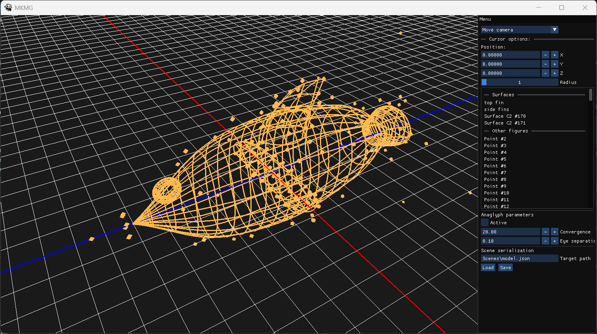

# MyCAD
The program was developed as part of the course 'Computer Methods in Geometric Modeling'.

## Stack

### Main:
- C++
- OpenGL (GLSL)
### Dependencies:
- ImGui - UI
- GLFW - windowing
- GLM - math
- [SceneSerializer](https://github.com/abstrackt/Scene-Serializer) - serialization
